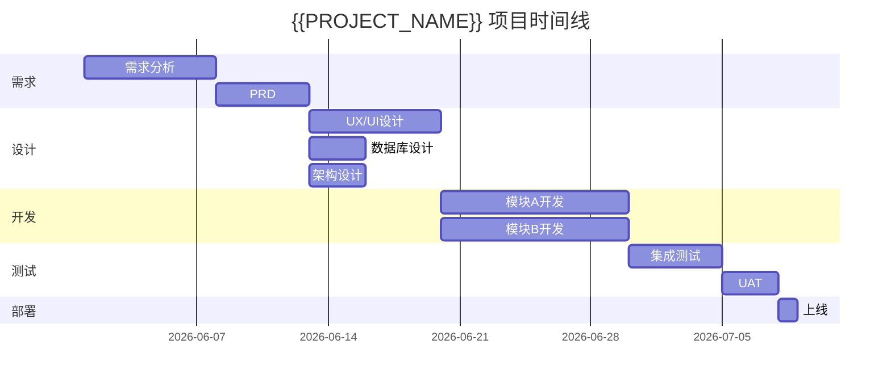

# {{PROJECT_NAME}} — PMP 项目管理文档

> **版本**: v0.1 | **状态**: 草稿 | **更新日期**: {{DATE}}

---

## 1. 项目章程

- **项目名称**: {{PROJECT_NAME}}
- **项目经理**: [姓名]
- **发起人**: [姓名]
- **项目目标**: [SMART 目标]
- **预算范围**: [金额范围]
- **关键干系人**: [列表]

## 2. 范围管理

### 2.1 项目范围
- **包括 (In Scope)**:
  - [范围项1]
  - [范围项2]
- **不包括 (Out of Scope)**:
  - [排除项1]

### 2.2 WBS（工作分解结构）
```
{{PROJECT_NAME}}
├── 1.0 需求分析
│   ├── 1.1 用户调研
│   └── 1.2 PRD 编写
├── 2.0 设计
│   ├── 2.1 用户体验设计
│   ├── 2.2 数据库设计
│   └── 2.3 架构设计
├── 3.0 开发
│   ├── 3.1 模块A
│   └── 3.2 模块B
├── 4.0 测试
└── 5.0 部署上线
```

## 3. 时间管理

### 3.1 项目时间线（甘特图）



### 3.2 关键里程碑

| 里程碑 | 预期日期 | 交付物 | 验收标准 |
|--------|----------|--------|----------|
| M1: 需求确认 | | | |
| M2: 设计完成 | | | |
| M3: 开发完成 | | | |
| M4: 测试通过 | | | |
| M5: 上线 | | | |

## 4. 成本管理

| 类别 | 预算 | 实际 | 差异 |
|------|------|------|------|
| 人力成本 | | | |
| 基础设施 | | | |
| 工具/许可证 | | | |
| 其他 | | | |
| **总计** | | | |

## 5. 质量管理

| 质量维度 | 标准 | 测量方法 |
|----------|------|----------|
| 代码质量 | lint 通过, 类型安全 | ESLint, TypeScript |
| 测试覆盖 | ≥80% | 覆盖率报告 |
| 性能 | 页面加载 < 2s | Lighthouse |
| 可用性 | 任务完成率 > 90% | 用户测试 |

## 6. 风险管理

| 风险 | 概率 | 影响 | 等级 | 应对策略 | 负责人 |
|------|------|------|------|----------|--------|
| [风险1] | H/M/L | H/M/L | | | |
| [风险2] | H/M/L | H/M/L | | | |

## 7. 沟通计划

| 沟通对象 | 频率 | 方式 | 内容 |
|----------|------|------|------|
| 团队内部 | 每日 | 站会 | 进度同步 |
| 干系人 | 每周 | 周报 | 进度汇报 |
| 管理层 | 里程碑 | 演示 | 阶段性成果 |
