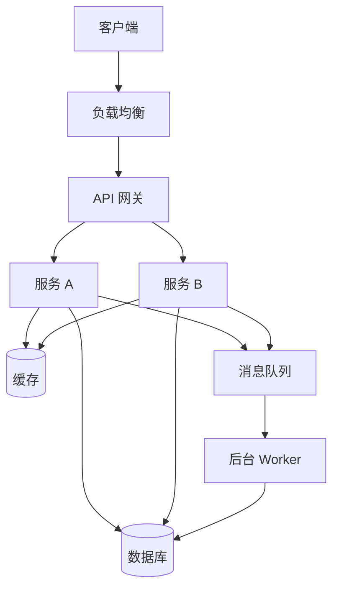
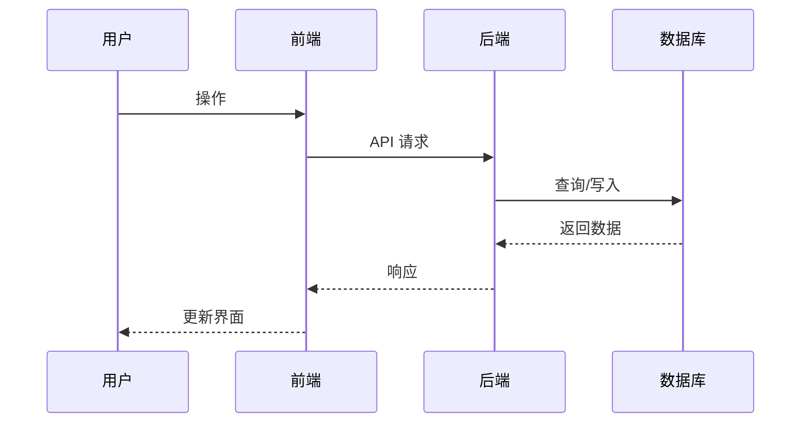

# {{PROJECT_NAME}} — 技术架构

> **版本**: v0.1 | **状态**: 草稿 | **更新日期**: {{DATE}}

---

## 1. 技术选型

### 1.1 前端

| 技术 | 版本 | 选型理由 |
|------|------|----------|
| [框架] | | |
| [UI 库] | | |
| [状态管理] | | |
| [构建工具] | | |

### 1.2 后端

| 技术 | 版本 | 选型理由 |
|------|------|----------|
| [运行时] | | |
| [框架] | | |
| [数据库] | | |
| [缓存] | | |

### 1.3 DevOps

| 技术 | 版本 | 用途 |
|------|------|------|
| [容器化] | | |
| [CI/CD] | | |
| [部署平台] | | |

---

## 2. 系统架构图



---

## 3. 代码模块划分

### 3.1 项目目录结构

```
src/
├── api/               # API 接口层
│   ├── controllers/   # 控制器
│   ├── middleware/     # 中间件
│   └── routes/        # 路由定义
├── services/          # 业务逻辑层
│   ├── [service1]/
│   └── [service2]/
├── models/            # 数据模型
├── utils/             # 工具函数
├── config/            # 配置文件
├── types/             # 类型定义
└── index.ts           # 入口文件
```

### 3.2 模块职责

| 模块 | 职责 | 负责人 |
|------|------|--------|
| [模块名] | [描述] | |
| [模块名] | [描述] | |

---

## 4. API 设计概览

### 4.1 API 规范

- **基地址**: `/api/v1`
- **认证方式**: JWT Bearer Token
- **响应格式**:
```json
{
  "code": 0,
  "message": "success",
  "data": {}
}
```

### 4.2 核心 API

| 方法 | 路径 | 说明 | 状态 |
|------|------|------|------|
| GET | /api/v1/[resource] | 列表查询 | ⏳ |
| POST | /api/v1/[resource] | 创建 | ⏳ |
| GET | /api/v1/[resource]/:id | 详情 | ⏳ |
| PUT | /api/v1/[resource]/:id | 更新 | ⏳ |
| DELETE | /api/v1/[resource]/:id | 删除 | ⏳ |

---

## 5. 数据流



---

## 6. 部署架构

### 6.1 环境

| 环境 | 地址 | 用途 |
|------|------|------|
| 开发 (dev) | | 日常开发 |
| 测试 (staging) | | 集成测试 |
| 生产 (prod) | | 线上服务 |

### 6.2 部署流程

```
代码提交 → CI 检测 → 构建 → 镜像推送 → 部署到环境
```

---

## 7. 开发顺序

### 阶段 1：MVP 核心链路（[时间]）

1. [模块A] — 基础框架搭建
2. [模块B] — 核心业务逻辑
3. [模块C] — 基础 API

### 阶段 2：功能完善（[时间]）

1. [模块D]
2. [模块E]

### 阶段 3：优化与增强（[时间]）

1. [性能优化]
2. [附加功能]
